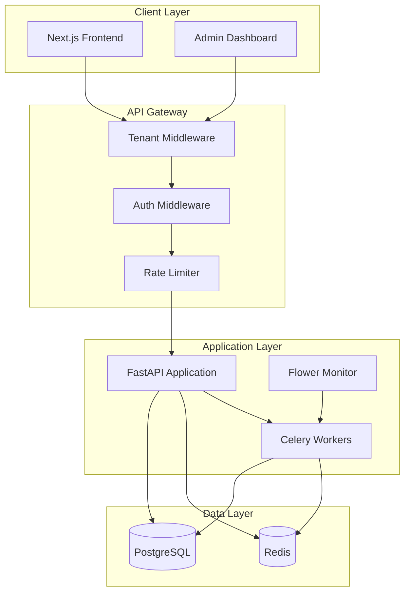
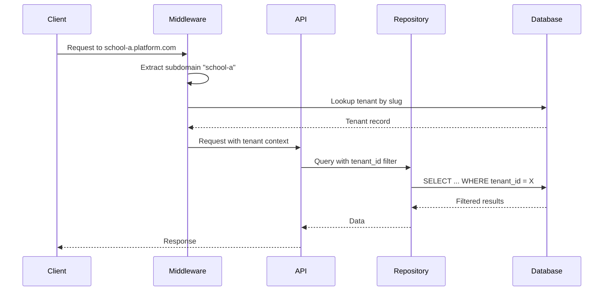
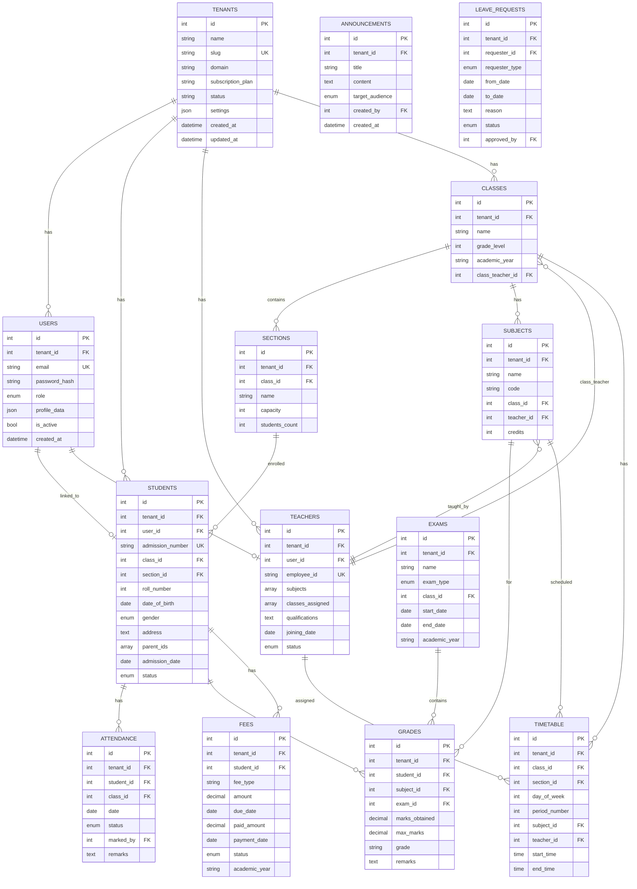

# Design Document: Multi-Tenancy School ERP System

## Overview

This document outlines the technical design for a comprehensive multi-tenancy School ERP system. The platform enables multiple schools to operate independently with complete data isolation using subdomain-based tenant identification. The system comprises a FastAPI backend with PostgreSQL, Redis, and Celery; a Next.js 14+ frontend with Tailwind CSS and shadcn/ui; and a super admin dashboard.

## Architecture

### High-Level Architecture



### Multi-Tenancy Flow



## Components and Interfaces

### Backend Components

#### 1. Tenant Middleware (`app/middleware/tenant.py`)

```python
class TenantMiddleware:
    async def __call__(self, request: Request, call_next) -> Response:
        """Extract tenant from subdomain and inject into request state."""
        
    def extract_tenant_slug(self, host: str) -> str:
        """Parse subdomain from host header."""
        
    async def get_tenant(self, slug: str) -> Tenant | None:
        """Lookup tenant by slug with Redis caching."""
```

#### 2. Authentication Service (`app/services/auth_service.py`)

```python
class AuthService:
    def create_access_token(self, user_id: int, tenant_id: int, role: str) -> str:
        """Generate JWT access token with claims."""
        
    def create_refresh_token(self, user_id: int) -> str:
        """Generate refresh token."""
        
    def verify_token(self, token: str) -> TokenPayload:
        """Validate and decode JWT token."""
        
    def hash_password(self, password: str) -> str:
        """Hash password using bcrypt."""
        
    def verify_password(self, plain: str, hashed: str) -> bool:
        """Verify password against hash."""
```

#### 3. Base Repository (`app/repositories/base.py`)

```python
class TenantAwareRepository(Generic[T]):
    def __init__(self, db: Session, tenant_id: int):
        self.db = db
        self.tenant_id = tenant_id
        
    def get_base_query(self) -> Query:
        """Return query filtered by tenant_id."""
        
    async def get_by_id(self, id: int) -> T | None:
        """Get entity by ID within tenant scope."""
        
    async def list(self, filters: dict, page: int, size: int) -> PaginatedResult[T]:
        """List entities with filtering and pagination."""
        
    async def create(self, data: dict) -> T:
        """Create entity with tenant_id."""
        
    async def update(self, id: int, data: dict) -> T:
        """Update entity within tenant scope."""
        
    async def soft_delete(self, id: int) -> bool:
        """Soft delete entity."""
```

#### 4. RBAC Permission Checker (`app/utils/permissions.py`)

```python
class PermissionChecker:
    PERMISSIONS: dict[str, list[str]]  # permission -> allowed roles
    
    def has_permission(self, user_role: str, permission: str) -> bool:
        """Check if role has permission."""
        
    def require_permission(self, permission: str) -> Callable:
        """Decorator for endpoint permission checking."""
```

#### 5. Cache Service (`app/services/cache_service.py`)

```python
class CacheService:
    def __init__(self, redis: Redis, tenant_id: int):
        self.redis = redis
        self.tenant_id = tenant_id
        
    def _key(self, entity: str, id: str) -> str:
        """Generate tenant-prefixed cache key."""
        
    async def get(self, entity: str, id: str) -> dict | None:
        """Get cached value."""
        
    async def set(self, entity: str, id: str, value: dict, ttl: int) -> None:
        """Set cached value with TTL."""
        
    async def invalidate(self, entity: str, id: str) -> None:
        """Invalidate cache entry."""
```

### Frontend Components

#### 1. Auth Context (`context/AuthContext.tsx`)

```typescript
interface AuthContextType {
  user: User | null;
  isAuthenticated: boolean;
  isLoading: boolean;
  login: (email: string, password: string) => Promise<void>;
  logout: () => void;
  refreshToken: () => Promise<void>;
}
```

#### 2. Tenant Context (`context/TenantContext.tsx`)

```typescript
interface TenantContextType {
  tenant: Tenant | null;
  settings: TenantSettings;
  isLoading: boolean;
}
```

#### 3. API Client (`lib/api.ts`)

```typescript
class ApiClient {
  private baseUrl: string;
  private accessToken: string | null;
  
  async request<T>(endpoint: string, options?: RequestOptions): Promise<T>;
  async get<T>(endpoint: string, params?: object): Promise<T>;
  async post<T>(endpoint: string, data: object): Promise<T>;
  async put<T>(endpoint: string, data: object): Promise<T>;
  async delete(endpoint: string): Promise<void>;
  
  setAccessToken(token: string): void;
  clearAccessToken(): void;
}
```

### API Endpoints Interface

| Module | Endpoint | Method | Description |
|--------|----------|--------|-------------|
| Auth | `/api/auth/register` | POST | Register new tenant |
| Auth | `/api/auth/login` | POST | User login |
| Auth | `/api/auth/refresh` | POST | Refresh token |
| Auth | `/api/auth/me` | GET | Current user profile |
| Students | `/api/students` | GET/POST | List/Create students |
| Students | `/api/students/{id}` | GET/PUT/DELETE | Student CRUD |
| Teachers | `/api/teachers` | GET/POST | List/Create teachers |
| Teachers | `/api/teachers/{id}` | GET/PUT | Teacher details/update |
| Classes | `/api/classes` | GET/POST | List/Create classes |
| Sections | `/api/sections` | GET/POST | List/Create sections |
| Attendance | `/api/attendance/mark` | POST | Bulk mark attendance |
| Attendance | `/api/attendance` | GET | Get attendance records |
| Grades | `/api/grades` | GET/POST | List/Create grades |
| Grades | `/api/grades/report-card/{id}` | GET | Generate report card |
| Fees | `/api/fees` | GET/POST | List/Create fees |
| Fees | `/api/fees/{id}/payment` | POST | Record payment |
| Timetable | `/api/timetable` | GET/POST | List/Create entries |
| Announcements | `/api/announcements` | GET/POST | List/Create |
| Reports | `/api/reports/*` | GET | Various reports |

## Data Models

### Database Schema



### Pydantic Schemas

```python
# Tenant schemas
class TenantCreate(BaseModel):
    name: str
    slug: str = Field(pattern=r'^[a-z0-9-]+$')
    admin_email: EmailStr
    admin_password: str = Field(min_length=8)

class TenantResponse(BaseModel):
    id: int
    name: str
    slug: str
    status: str
    subscription_plan: str
    created_at: datetime

# User schemas
class UserCreate(BaseModel):
    email: EmailStr
    password: str = Field(min_length=8)
    role: Literal['admin', 'teacher', 'student', 'parent']
    profile_data: dict = {}

class UserResponse(BaseModel):
    id: int
    email: str
    role: str
    is_active: bool
    profile_data: dict

# Student schemas
class StudentCreate(BaseModel):
    admission_number: str
    class_id: int
    section_id: int
    roll_number: int
    date_of_birth: date
    gender: Literal['male', 'female', 'other']
    address: str
    user_email: EmailStr

class StudentResponse(BaseModel):
    id: int
    admission_number: str
    class_id: int
    section_id: int
    roll_number: int
    status: str
    user: UserResponse

# Attendance schemas
class AttendanceMark(BaseModel):
    student_id: int
    status: Literal['present', 'absent', 'late', 'half_day']
    remarks: str | None = None

class BulkAttendanceCreate(BaseModel):
    class_id: int
    section_id: int
    date: date
    records: list[AttendanceMark]

# Grade schemas
class GradeCreate(BaseModel):
    student_id: int
    subject_id: int
    exam_id: int
    marks_obtained: Decimal
    max_marks: Decimal
    remarks: str | None = None

# Fee schemas
class FeeCreate(BaseModel):
    student_id: int
    fee_type: str
    amount: Decimal
    due_date: date
    academic_year: str

class PaymentRecord(BaseModel):
    amount: Decimal
    payment_method: str
    transaction_id: str | None = None
```


## Correctness Properties

*A property is a characteristic or behavior that should hold true across all valid executions of a system-essentially, a formal statement about what the system should do. Properties serve as the bridge between human-readable specifications and machine-verifiable correctness guarantees.*

Based on the prework analysis, the following correctness properties have been identified. Redundant properties have been consolidated for efficiency.

### Property 1: Tenant Data Isolation

*For any* database query executed within a tenant context, all returned records SHALL have a tenant_id matching the current tenant context.

**Validates: Requirements 1.2**

### Property 2: Tenant-Prefixed Cache Keys

*For any* Redis cache operation, the generated cache key SHALL follow the format `{tenant_id}:cache:{entity}:{id}`.

**Validates: Requirements 1.3**

### Property 3: Tenant Slug Uniqueness

*For any* tenant registration attempt, if a tenant with the same slug already exists, the registration SHALL be rejected.

**Validates: Requirements 2.2**

### Property 4: Password Hash Verification Round-Trip

*For any* valid password string, hashing the password and then verifying the original password against the hash SHALL return true.

**Validates: Requirements 3.4**

### Property 5: JWT Token Round-Trip

*For any* valid user with tenant and role, creating a JWT token and then verifying/decoding it SHALL return the original user_id, tenant_id, and role claims.

**Validates: Requirements 3.1, 3.3**

### Property 6: Role-Based Access Control Enforcement

*For any* user-resource-permission combination, the access decision SHALL match the defined permission rules where admins have full tenant access, teachers have assigned class access, students have own-data read access, and parents have linked-children read access.

**Validates: Requirements 4.1, 4.2, 4.3, 4.4, 4.5**

### Property 7: Entity Creation Tenant Association

*For any* entity (student, teacher, class, section, exam, fee, announcement, leave request) created within a tenant context, the created record SHALL have tenant_id set to the current tenant.

**Validates: Requirements 5.1, 6.1, 7.1, 9.1, 10.1, 11.1, 12.1, 13.1**

### Property 8: Soft Delete Preservation

*For any* soft-deleted student record, the record SHALL remain in the database with a deleted status, and historical data (attendance, grades, fees) SHALL remain accessible.

**Validates: Requirements 5.4**

### Property 9: Bulk Attendance Recording

*For any* bulk attendance marking operation with N student records, exactly N attendance records SHALL be created with correct student_id, status, date, and marked_by fields.

**Validates: Requirements 8.1, 8.2**

### Property 10: Attendance Percentage Calculation

*For any* student with attendance records, the calculated attendance percentage SHALL equal (present_days + late_days * 0.5 + half_days * 0.5) / total_days * 100.

**Validates: Requirements 8.4**

### Property 11: Grade Calculation Consistency

*For any* grade entry with marks_obtained and max_marks, the calculated percentage SHALL equal marks_obtained / max_marks * 100, and the grade letter SHALL match the configured grading scale.

**Validates: Requirements 9.2**

### Property 12: Fee Payment Status Update

*For any* fee record, after recording a payment, the fee status SHALL be 'paid' if paid_amount >= amount, 'partial' if 0 < paid_amount < amount, or 'pending' if paid_amount = 0.

**Validates: Requirements 10.2**

### Property 13: Timetable Conflict Detection

*For any* timetable entry creation, if a teacher is already assigned to another class at the same day/period/time, the creation SHALL be rejected with a conflict error.

**Validates: Requirements 11.2**

### Property 14: Announcement Role Filtering

*For any* user requesting announcements, the returned announcements SHALL only include those where target_audience is 'all' OR matches the user's role.

**Validates: Requirements 12.2**

### Property 15: Pagination Bounds

*For any* paginated list request with page_size N, the returned results SHALL contain at most N items, and the total_count SHALL reflect the actual count of matching records.

**Validates: Requirements 16.2**

### Property 16: Cache Invalidation on Update

*For any* entity update operation, the corresponding cache entry SHALL be invalidated (removed or updated) before the operation completes.

**Validates: Requirements 16.3**

### Property 17: Audit Log Completeness

*For any* sensitive operation (create, update, delete on core entities), an audit log entry SHALL be created containing user_id, action, entity_type, entity_id, and timestamp.

**Validates: Requirements 17.3**

### Property 18: Filtered Query Result Matching

*For any* search/filter query with specified criteria, all returned records SHALL match all specified filter conditions.

**Validates: Requirements 5.2, 6.4, 8.3**

## Error Handling

### Backend Error Handling Strategy

```python
# Custom exception classes
class ERPException(Exception):
    def __init__(self, message: str, code: str, status_code: int = 400):
        self.message = message
        self.code = code
        self.status_code = status_code

class TenantNotFoundError(ERPException):
    def __init__(self, slug: str):
        super().__init__(f"Tenant '{slug}' not found", "TENANT_NOT_FOUND", 404)

class AuthenticationError(ERPException):
    def __init__(self, message: str = "Invalid credentials"):
        super().__init__(message, "AUTH_ERROR", 401)

class PermissionDeniedError(ERPException):
    def __init__(self, resource: str):
        super().__init__(f"Permission denied for {resource}", "PERMISSION_DENIED", 403)

class ValidationError(ERPException):
    def __init__(self, errors: list[dict]):
        super().__init__("Validation failed", "VALIDATION_ERROR", 422)
        self.errors = errors

class ConflictError(ERPException):
    def __init__(self, message: str):
        super().__init__(message, "CONFLICT", 409)
```

### Error Response Format

```json
{
  "error": {
    "code": "VALIDATION_ERROR",
    "message": "Validation failed",
    "details": [
      {"field": "email", "message": "Invalid email format"},
      {"field": "password", "message": "Password must be at least 8 characters"}
    ]
  }
}
```

### Frontend Error Handling

- API client intercepts all responses and throws typed errors
- Global error boundary catches unhandled errors
- Toast notifications display user-friendly error messages
- Form validation errors displayed inline with fields
- Network errors trigger retry logic with exponential backoff

## Testing Strategy

### Testing Framework Selection

- **Backend**: pytest with pytest-asyncio for async tests
- **Property-Based Testing**: Hypothesis (Python) for backend properties
- **Frontend**: Jest + React Testing Library for unit tests
- **E2E Testing**: Playwright for critical user flows

### Unit Testing Approach

Unit tests verify specific examples and edge cases:

- Repository methods with mock database
- Service layer business logic
- Utility functions (password hashing, token generation)
- Pydantic schema validation
- React component rendering and interactions

### Property-Based Testing Approach

Property tests verify universal properties across all valid inputs using Hypothesis:

- Each correctness property maps to one property-based test
- Generators create valid domain objects (tenants, users, students, etc.)
- Tests run minimum 100 iterations per property
- Tests tagged with format: `**Feature: school-erp-multi-tenancy, Property {N}: {description}**`

Example property test structure:

```python
from hypothesis import given, strategies as st, settings

class TestTenantIsolation:
    """**Feature: school-erp-multi-tenancy, Property 1: Tenant Data Isolation**"""
    
    @given(
        tenant_id=st.integers(min_value=1, max_value=1000),
        other_tenant_id=st.integers(min_value=1, max_value=1000)
    )
    @settings(max_examples=100)
    def test_queries_filter_by_tenant(self, tenant_id, other_tenant_id):
        """For any query, results only contain records matching tenant_id."""
        # Setup: Create records for both tenants
        # Execute: Query with tenant_id context
        # Assert: All results have matching tenant_id
        pass
```

### Test Organization

```
backend/
├── tests/
│   ├── unit/
│   │   ├── test_auth_service.py
│   │   ├── test_repositories.py
│   │   └── test_utils.py
│   ├── properties/
│   │   ├── test_tenant_isolation.py
│   │   ├── test_rbac.py
│   │   ├── test_attendance.py
│   │   └── test_grades.py
│   ├── integration/
│   │   ├── test_auth_endpoints.py
│   │   ├── test_student_endpoints.py
│   │   └── test_attendance_endpoints.py
│   └── conftest.py (fixtures)

frontend/
├── __tests__/
│   ├── components/
│   ├── hooks/
│   └── utils/
├── e2e/
│   ├── auth.spec.ts
│   ├── students.spec.ts
│   └── attendance.spec.ts
```

### Test Coverage Goals

- Unit tests: 80% code coverage on business logic
- Property tests: All 18 correctness properties covered
- Integration tests: All API endpoints tested
- E2E tests: Critical user journeys (login, student CRUD, attendance marking)
